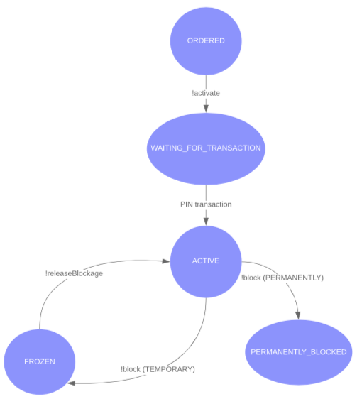
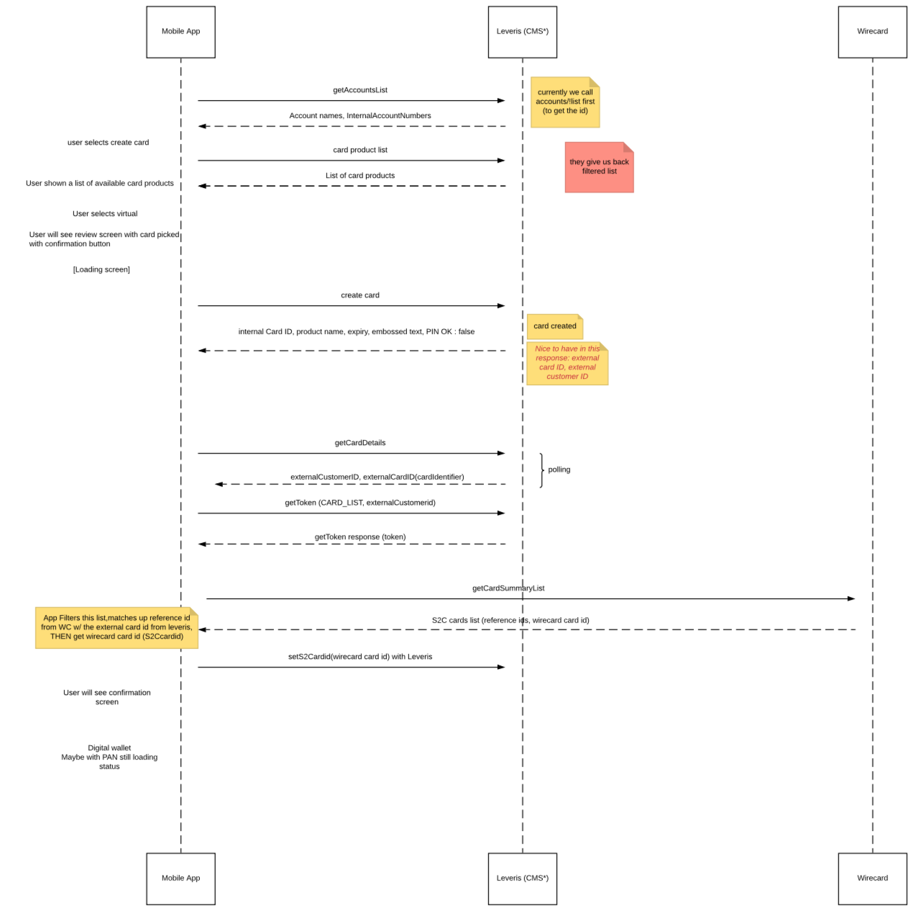
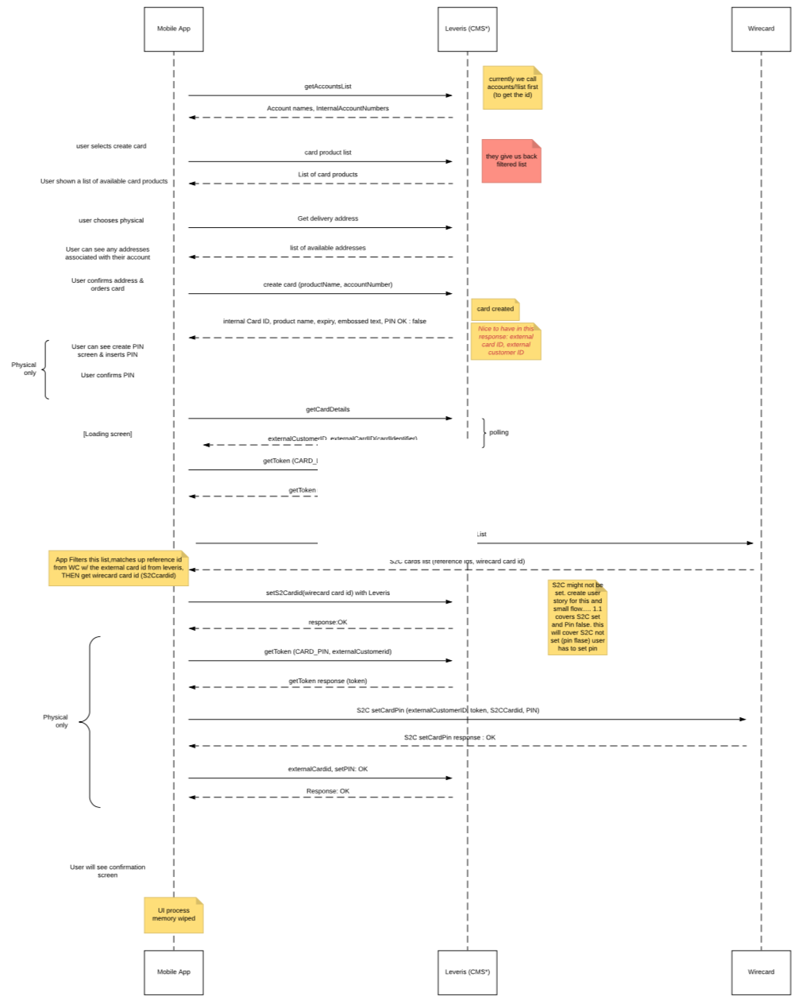

# Cards

The cards service is responsible for allowing a user to create, activate and manage his card(s).

## Overview

There are two types of cards that are supported by the cards service:

###### Virtual card

Virtual cards are the most basic representation of a card with a card number, expiry date and CVV/CVC.
They can be used for e-commerce transactions and, when supported, through a smartphone using NFC (Near-Field-Communication) technology.

###### Physical card

Physical cards have an associated plastic card which the user owns and can use at ATMs and in POS.
Every physical card must be created by an external card provider and be delivered to the user by post or handed over in a physical branch.

## User enabled actions

Using the cards service the user is able to:

- [Create virtual cards](#creating-a-virtual-card)
- [Order physical cards to be delivered to the specified address](#ordering-a-physical-card)
- [View card details like its number, expiry date and CVV/CVC](#view-card-details)
- [Freeze/unfreeze the card](#freezeunfreeze-card)
- [Manage security and limits of card usage](#card-limits-and-security)
- [Cancel the card](#cancel-card)

For physical cards the user of the cards service can also:

- [Activate the card](#activating-the-physical-card)
- [Change the PIN](#change-physical-card-pin)
- [Report the card as lost, stolen or detained (damaged or broken)](#report-physical-card)

## Card statuses

The card has an associated status, from which we can know what to communicate to the user and what actions the user is able to perform.

- **ORDERED** - Card was created and ordered. For virtual cards this status is momentary and doesn't require any further action from the user. For physical cards, the user will be able to track the card delivery and activate it when the card has been received.
- **WAITING_FOR_TRANSACTION** - The card was activated in the app but needs the first PIN transaction in a POS or ATM.
- **ACTIVE** - The card is fully active.
- **FROZEN** - Card is blocked temporarily. This can be triggered by the user or by the bank. When frozen by the user, the user will be able to unfreeze through the cards service. When frozen by the bank, the user will have to contact the bank and only the bank can unfreeze it.
- **PERMANENTLY_BLOCKED** - Card was reported as lost, stolen or detained and is now permanently blocked. It can't be used for any type of transaction.

Note that after performing an action that can update of the status ([activate](#activating-the-physical-card), [freeze](#freeze), etc), the actual status of the card may take a while to update. For this cases, it's recommended to use the polling technique until the status has been updated to the expected status.

## Prerequisites

The cards service requires that the user has been onboarded and is logged in to the Internet Banking service.
The back office defines how many cards and which type of the cards the user is able to own.

## Creating/Ordering a card

To create a virtual card or to order a physical card the user needs to indicate which account the card will be associated to and which card product is desired.

To get the list of accounts we can use the [/accounts/!list](https://doc.ffc.internal/api/mw-gen-payment-card-ib/payment-card-ib/latest/#docs/method/#1132) endpoint.

To get the list of available card products we can use the [/products/!list](https://doc.ffc.internal/api/mw-gen-payment-card-ib/payment-card-ib/latest/#docs/method/#837) endpoint.

### Creating a virtual card

To create a virtual card the user needs to indicate a card product with the technology of type **virtual**.
We can then use the [/cards/!create](https://doc.ffc.internal/api/mw-gen-payment-card-ib/payment-card-ib/latest/#docs/method/#874) endpoint passing the required **accountNumber** and **productName**.

After the creation of the virtual card with the cards service, we need to contact our external card provider to obtain the identifier of the card in the external card provider's service, the **s2cCardId**. To do that we need to use the **externalCustomerId** to get a token, through the [/cards/!token](https://doc.ffc.internal/api/mw-gen-payment-card-ib/payment-card-ib/latest/#docs/method/#848) endpoint, so we can get the list of cards registered in the provider's service. We then use this list to find the card with the same **externalCardId** and get its **s2cCardId**. We then need to register this with the cards service through the [/cards/{cardId}/!setS2cCardId](https://doc.ffc.internal/api/mw-gen-payment-card-ib/payment-card-ib/latest/#docs/method/#1086).

See the sequence diagram below:

### Ordering a physical card

To order a physical card the user needs to create the card first. The process of a physical card creation is similar to the creation of a virtual card with the difference that the technology of the card product has to be of the type **contactless**, and we can also provide an optional delivery address. We can then use the [/cards/!create](https://doc.ffc.internal/api/mw-gen-payment-card-ib/payment-card-ib/latest/#docs/method/#874) endpoint passing the required **accountNumber**, **productName** and the optional **deliveryAddress**. In case where the **deliveryAddress** is not provided, the cards service will use the address registered during the onboard of the user.

After creating a card with the cards service, we need to contact our external card provider to obtain the identifier of the card in the external card provider's service, the **s2cCardId**. To do that we need to use the **externalCustomerId** to get a token, through the [/cards/!token](https://doc.ffc.internal/api/mw-gen-payment-card-ib/payment-card-ib/latest/#docs/method/#848) endpoint, so we can get the list of cards registered in the provider's service. We then use this list to find the card with the same **externalCardId** and get its **s2cCardId**. We then need to register this with the cards service through the [/cards/{cardId}/!setS2cCardId](https://doc.ffc.internal/api/mw-gen-payment-card-ib/payment-card-ib/latest/#docs/method/#1086).

Since this is a physical card, it has to have a PIN associated. We can do this after obtaining the **s2cCardId**.
After the user provides the PIN, we need to request a new token to contact the external card provider's service. We then can use the token to create the PIN using the provider's service. Note that the cards service will never request or store the PIN directly, this is only allowed when using the external card provider's service directly.

When the PIN is created on the external card provider's service, we have to tell the cards service that this operation was finished successfully. To do that, we can use the [/cards/{cardId}/!setPinOk](https://doc.ffc.internal/api/mw-gen-payment-card-ib/payment-card-ib/latest/#docs/method/#1100) endpoint. <!-- TODO: this was refactored -->

See the sequence diagram below:

#### Activating the physical card

After ordering a physical card, the user has the option to activate the card when the card was delivered to him.
To do that we can use the [/cards/{cardId}/!activate](https://doc.ffc.internal/api/mw-gen-payment-card-ib/payment-card-ib/latest/#docs/method/#915) endpoint.

## View card details

The cards service doesn't provide the security details (Full number PAN, CVV/CVC) directly, but we can get this values from the external card provider's service.
To do that we need to obtain a token for accessing the provider's service using the [/cards/!token](https://doc.ffc.internal/api/mw-gen-payment-card-ib/payment-card-ib/latest/#docs/method/#848) endpoint. We can then access the provider's service to obtain these details.

## Change physical card PIN

The cards service never requests or stores the PIN of the card. To change the PIN of the user's physical card we need to do it through the external card provider's service.
To do that we need to obtain a token for accessing the provider's service using the [/cards/!token](https://doc.ffc.internal/api/mw-gen-payment-card-ib/payment-card-ib/latest/#docs/method/#848) endpoint. We can then access the provider's service to change the PIN.

Note that after a PIN change, the user is required to make a PIN transaction with his physical card on an ATM or POS.
<!-- TODO add new refactor -->

## Report physical card

The user can report a physical card as lost, stolen or detained (damaged or broken). To do this we can use the [/cards/{cardId}/!block](https://doc.ffc.internal/api/mw-gen-payment-card-ib/payment-card-ib/latest/#docs/method/#932) endpoint with the blockage type **PERMANENT**.

Note that this action can't be reverted and the user will not be able to use the card anymore after this action.

## Freeze/unfreeze card

###### Freeze

The user is allowed to freeze a card. When the card is frozen the card is blocked and no actions can be performed.
To freeze the card we can use the [/cards/{cardId}/!block](https://doc.ffc.internal/api/mw-gen-payment-card-ib/payment-card-ib/latest/#docs/method/#932) endpoint with the blockage type **TEMPORARY**.

###### Unfreeze card

When the card has been frozen by the user, the user is allowed to unfreeze it. To unfreeze the card we can use the [/cards/{cardId}/!releaseBlockage](https://doc.ffc.internal/api/mw-gen-payment-card-ib/payment-card-ib/latest/#docs/method/#952) endpoint.

## Card limits and security

### Security

The user is able to enable or disable features that the card may support. The security options are defined below.

###### Enable e-commerce

To enable or disable e-commerce we can use the [/cards/{idCard}/!updateEcommerce](https://doc.ffc.internal/api/mw-gen-payment-card-ib/payment-card-ib/latest/#docs/method/#1031) endpoint and pass in a boolean with the desired option.

### Limits

The default card limits are defined at the card product level, which means all cards are issued with predefined limits.

All limits are defined based on the same time period:
- Daily - limit is defined by maximum amount or number of transactions per day
- Weekly - limit is defined by maximum amount or number of transactions per week
- Monthly - limit is defined by maximum amount or number of transactions per month

Each limit can be defined by a maximum amount or by the number of transactions

The user is allowed to change each limit up to a maximum limit. The maximum limit value can be obtained from each limit definition on the card details from the [/cards/{cardId}](https://doc.ffc.internal/api/mw-gen-payment-card-ib/payment-card-ib/latest/#docs/method/#902) endpoint.

###### Permanent limit

Changing the permanent limit will change the default limit forever. This means it can never be reset to the original value (unless the original value is passed in as value to the endpoint).
To change the permanent limit(s) we can use the [/cards/{cardId}/!setPermanentLimits](https://doc.ffc.internal/api/mw-gen-payment-card-ib/payment-card-ib/latest/#docs/method/#1011) endpoint. This endpoint can change multiple limits at the same time.

###### Temporary limit

The user has the option to create a temporary limit that will stay valid until the provided date. To create a temporary limit(s) we can use the [/cards/{cardId}/!setTemporaryLimits](https://doc.ffc.internal/api/mw-gen-payment-card-ib/payment-card-ib/latest/#docs/method/#991) endpoint. This endpoint can change multiple limits at the same time.

###### Remove temporary limit

The temporary limits can be removed at any time. This action will reset the limit to its permanent value. To remove a temporary limit(s) we can use the [/cards/{cardId}/!setTemporaryLimits](https://doc.ffc.internal/api/mw-gen-payment-card-ib/payment-card-ib/latest/#docs/method/#991) endpoint and pass as parameter an array of the temporary limit **name** without the limit **value** and **validTo** date. This endpoint can change multiple limits at the same time.

## Cancel card

If the user wants to cancel the card, we can use the [/cards/{cardId}/!cancel](https://doc.ffc.internal/api/mw-gen-payment-card-ib/payment-card-ib/latest/#docs/method/#966) endpoint.

Note that this action can't be reverted and the user will not be able to use the card anymore after this action.
