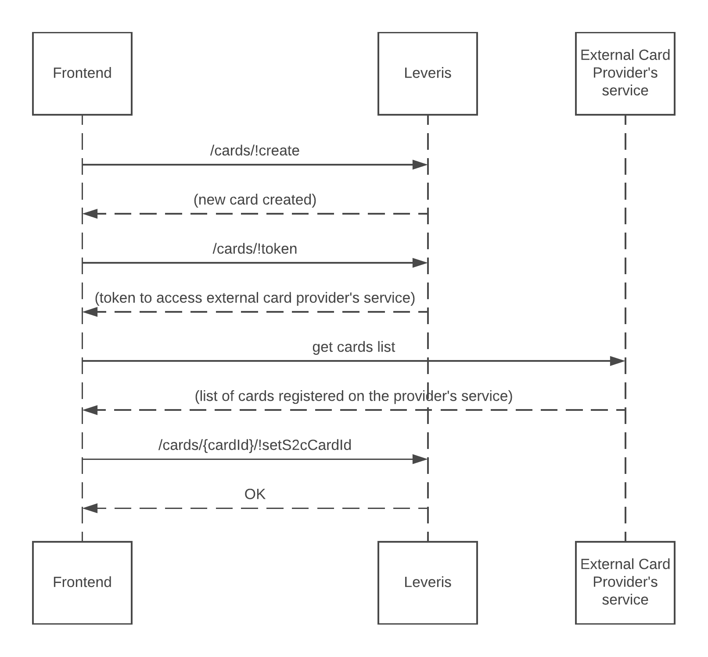
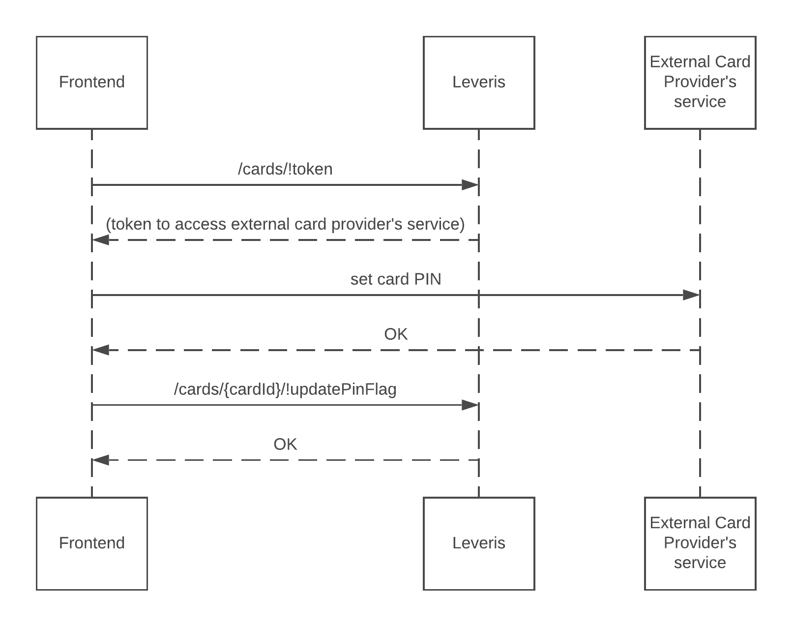

# Cards

The cards service lets users create, activate and manage their card(s).

## Responsibilities of the service

Ultimately the cards service is responsible for:
* **Creating cards** and other associated activities e.g. setting the delivery address, activating the card and setting the PIN
* **Managing security settings** e.g. the types of transactions allowed and limit management
* **Managing the card lifecycle** e.g. Reporting cards lost or stolen, freezing/unfreezing and card cancellation
* **Managing card attributes** such as the PIN value

There are two types of cards that are supported by the cards service:
* **Virtual cards**: Virtual cards are the most basic representation of a card with a card number, expiry date and CVV/CVC. They can be used for e-commerce transactions and, when supported, with NFC (Near-Field-Communication) capable smartphones
* **Physical cards**: Physical cards have an associated plastic card which can be used at ATMs and POS's (Points of Sale). Every physical card must be created by an external card provider and subsequently delivered to the user by post or handed over in a physical branch

## How to use the service

The cards service requires that the user has been:
* **Onboarded** and is
* **Logged in** to the Internet Banking service

The back office configuration will ultimately define how many, and which type of the cards the user is able to own. However, the returned endpoint values incorporate this configuration.

Before using the service, it's recommended that the card statuses be well understood. Please see [Card statuses](#card-statuses) for more details.

Via the cards service, the user is able to:

-   [Order a card](#order-a-card)
-   [View secure card details (full PAN number and CVV/CVC)](#view-secure-card-details)
-   [Freeze/unfreeze the card](#freezeunfreeze-card)
-   [Manage security settings](#manage-security-settings)
-   [Manage limits](#manage-limits)
-   [Cancel the card](#cancel-the-card)

For physical cards, the users of the cards service can also:

-   [Change the PIN (physical cards only)](#change-the-pin-physical-cards-only)
-   [Report the card as lost, stolen or detained (physical cards only)](#report-the-card-as-lost-stolen-or-detained-physical-cards-only)

### Card statuses

Each card has an associated status. From this, we can determine what to communicate to the user and what actions the user is able to perform.

- **Ordered**: The card has been created on the system and is ordered. For virtual cards, this status is momentary and doesn't require any further action from the user. For physical cards, the user will be able to track the card's delivery status and activate it when received
- **Waiting for 1st PIN authorised transaction**: The card was activated in the app but needs a PIN transaction via an internet connected POS or ATM. Physical cards cannot be used for transactions during this status. Virtual cards are unaffected by this status
- **Active**: The card is fully active and can be used regularly
- **Frozen**: The card is temporarily blocked. This can be triggered by the user or by the bank. When frozen by the user, the user will be able to unfreeze through the cards service. When frozen by the bank, it can only be unfrozen via the back-office interface
- **Permanently blocked**: The card was reported as lost, stolen or detained and is now permanently blocked. It can't be used for any type of transaction i.e. the card is effectively cancelled

Note that after performing an action that can update the status ([activate](#activating-the-card-physical-cards-only), [freeze](#freeze), etc), the actual status of the card may take a while to update. For these cases, it's recommended to use polling until the status has been updated to the expected status.

### Order a card

#### Getting started

To create a virtual card or to order a physical card the user needs to indicate which account the card will be associated with. To get the list of accounts we can use the `/accounts/!list` endpoint.

The user also needs to choose one of the available card products. The card product technology type defines which type of card will be created: **virtual** for virtual cards and **contactless** for physical cards. To get the list of available card products we can use the `/products/!list` endpoint.

When ordering a physical card, the user has the option to provide a delivery address. If not provided, the service will use the address registered during the onboarding process. To get the list of available delivery addresses we can use the `/delivery-addresses/!list` endpoint.

#### Creating the card

We can use the [/cards/!create](https://doc.ffc.internal/api/mw-gen-payment-card-ib/payment-card-ib/latest/#docs/method/#874) endpoint passing the required `accountNumber` and `productName`. If creating a physical card, we have the option to specify the `deliveryAddress`.

After creating, we need to contact our external card provider to obtain **their** identifier of the card in **their** service, the `s2cCardId`. To do that we need to use the **externalCustomerId** to get a token, through the [/cards/!token](https://doc.ffc.internal/api/mw-gen-payment-card-ib/payment-card-ib/latest/#docs/method/#848) endpoint, so we can get the list of cards registered in the provider's service. We then use this list to find the card with the same **externalCardId** and get its **s2cCardId**. We then need to register this with the cards service through the [/cards/{cardId}/!setS2cCardId](https://doc.ffc.internal/api/mw-gen-payment-card-ib/payment-card-ib/latest/#docs/method/#1086) endpoint.

See the sequence diagram below:

#### Setting the PIN (physical cards only)

When creating a physical card, we have to associate a PIN. We can do this after obtaining the **s2cCardId**.
After the user provides the PIN, we need to request a new token to contact the external card provider's service. We then can use the token to create the PIN using the provider's service. Note that the cards service will never request or store the PIN directly, this is only allowed when using the external card provider's service directly.

When the PIN is created on the external card provider's service, we have to tell the cards service that this operation was finished successfully. To do that, we can use the [/cards/{cardId}/!updatePinFlag](https://doc.ffc.internal/api/mw-gen-payment-card-ib/payment-card-ib/latest/#docs/method/#1100) endpoint.

See the sequence diagram below:

#### Activating the card (physical cards only)

After ordering a physical card, the user has the option to activate the card when delivered. Up until this point, the card cannot be used for transactions. To activate, we can use the `/cards/{cardId}/!activate` endpoint.

### View secure card details

The cards service doesn't provide the secure details (Full card PAN number, CVV/CVC) directly. However, we can get these values from the external card provider's service.
To do that, we need to obtain a token for accessing the provider's service using the `/cards/!token` endpoint. We can then access the provider's service as planned.

### Freeze/unfreeze card

#### Freeze

The user is allowed to freeze a card. When the card is frozen the card is blocked and no transactions can be made.
To freeze the card we can use the `/cards/{cardId}/!block` endpoint with the **temporary** blockage type.

#### Unfreeze card

When the card has been frozen by the user, the user is allowed to unfreeze it. To unfreeze the card we can use the `/cards/{cardId}/!releaseBlockage` endpoint.

### Manage security settings

#### Security

The user is able to enable or disable security features that the card may support e.g. contactless payments, magstripe payments etc. via the `/cards/{cardId}/!setSecurity` endpoint.

#### Enable e-commerce transactions

To enable or disable e-commerce transactions we can use the `/cards/{idCard}/!updateEcommerce` endpoint and pass in a boolean with the desired option.

### Manage limits

The default card limits are defined at the card product level, which means all cards are issued with predefined limits.

All limits are based on either **daily**, **weekly** or **monthly** periods. Each limit can be defined by a maximum amount or by the number of transactions during that period.

The user is allowed to change each limit up to a maximum value. The maximum value can be obtained from each limit definition on the card details from the `/cards/{cardId}` endpoint.

##### Change permanent limits

All cards carry a default limit. Modifying the permanent limit modifies this value in perpetuity. This means that it can't be reset to the original value unless the original value is passed to the endpoint once again.

To change the permanent limit(s) we can use the `/cards/{cardId}/!setPermanentLimits` endpoint. This endpoint can change multiple permanent limits at the same time.

##### Create temporary limits

A temporary limit that will stay valid until a certain provided date.

To create a temporary limit(s) we can use the `/cards/{cardId}/!setTemporaryLimits` endpoint. This endpoint can change multiple temporary limits at the same time.

##### Remove temporary limits

Temporary limits can be removed at any time. When removed, the card's limit will revert to the value of the permanent limit.

To remove a temporary limit(s) we can use the `/cards/{cardId}/!setTemporaryLimits` endpoint. Specifically, we must create an array of temporary limits that we will later pass to the endpoint. On the limit we intent to remove, we must remove the limit's `value` and `validTo` attributes. This endpoint can change multiple limits at the same time.

### Cancel the card

If the user wants to cancel the card, we can use the `[/cards/{cardId}/!cancel` endpoint.

Note that this action can't be reverted and the user will not be able to use the card thereafter.

### Change the PIN (physical cards only)

The cards service never requests or stores the PIN. To change it, we need use the external card provider's service.
Firstly, we need to obtain a token for accessing the provider's service using the `/cards/!token` endpoint. We can then access the provider's service to change the PIN.

Note that after a PIN change, the user is required to make a PIN transaction with their physical card at an ATM or POS before transactions can be made with the card.

<!-- TODO add new refactor -->

### Report the card as lost, stolen or detained (physical cards only)

The user can report a physical card as lost, stolen or detained (damaged or broken). To do this we can use the `/cards/{cardId}/!block` endpoint with the **permanent** blockage type.

Note that this action can't be reverted and the user will be unable to use the card thereafter.
