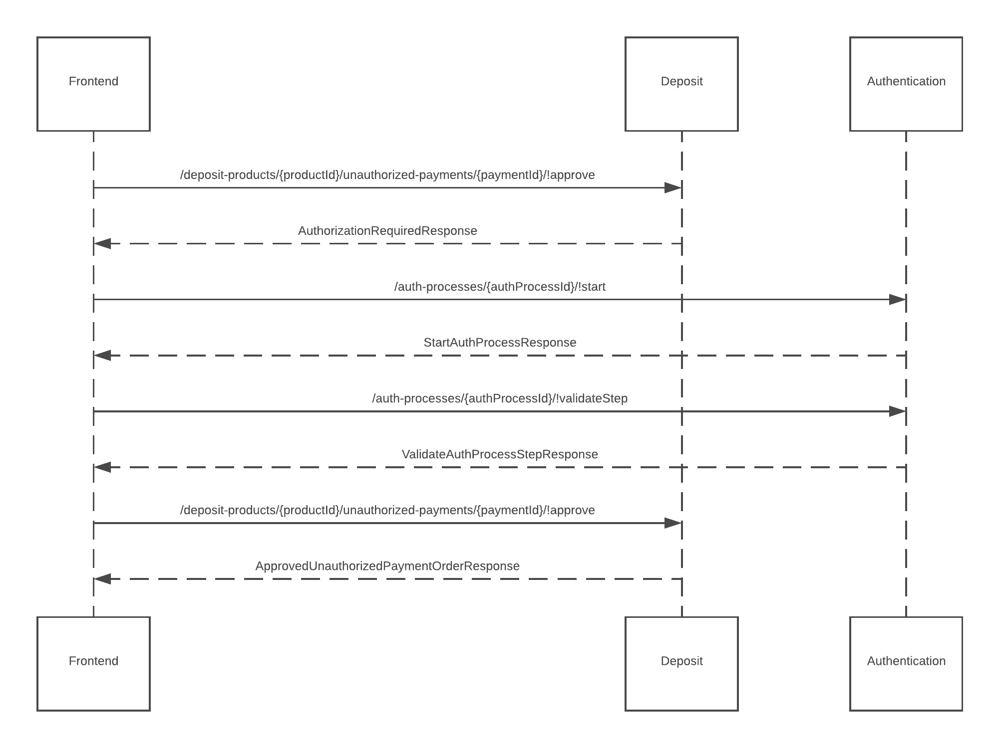

# IB Deposits

This service provides all information about a client's deposit products.

## Responsibilities of the service

Consumers of the service can:
- **View and manage deposit products**
- **View and manage transactions** within deposit products
- **Create** internal and external **payment orders**

## How to use the service

The **Deposit service** requires that the user has been onboarded and is logged in to the Internet Banking service.

There are 3 ways to use the service:
* [How to manage deposit products](#how-to-manage-deposit-products)
* [How to manage transactions](#how-to-manage-transactions) and
* [How to manage payments](#how-to-manage-payments)

### How to manage Deposit Products

A `deposit product` is created during the onboarding process (see [user activation service](https://doc.ffc.internal/book/mw-ib/mw-gen-user-activation-ib.html)). Its parameters are set depending on the deposit product `type` selected by the user at creation. A client can have multiple deposit products.

A product can also have multiple currency components where one is designated the *primary currency*. The aggregated balance of the account appears in this currency.

The customer can also change the *primary currency* and *activate/deactivate* the various currency components.

Note that certain operations (changing currency components, creating transactions) can only be made when the deposit product is in `ACTIVE` state.

The following use cases are supported on a deposit product:
- [Get balances](#get-balances)  
- [Exchange money](#exchange-money)
- [Share account information](#share-account-information)
- [Change primary currency](#change-primary-currency)
- [Activate/deactivate currency components](#activate-deactivate-currency-components)
    
#### Get balances
Retrieve the balance for each currency component by calling `/deposit-products/{idProduct}/!getBalance`.

#### Exchange money
To exchange money between currency components call `/deposit-products/{idProduct}/currency-exchanges`.

#### Share account information
To send user account information via email call `/deposit-products/{idProduct}/!emailAccountInfo`.

#### Change primary currency
To change the primary currency component call `/deposit-products/{idProduct}/currencyPriorities`. The desired primary current should have the highest priority.

#### Activate/deactivate currency components
A currency component can be activated by calling `/deposit-products/{idProduct}/!activateCurrency` and deactivated by calling `/deposit-products/{idProduct}/!deactivateCurrency`.

In order to deactivate a currency component, it **must** have zero balance and not be the primary currency.

The ability to activate or deactivate currency components also depends on the configuration of the specific deposit product.

### How to manage Transactions

The service allows a customer to retrieve and search all their transactions. They also have the ability to update some transaction data i.e add a note etc.

The platform supports *automatic currency conversion* with incoming/outgoing transactions. 

This can occur when an account has insufficient funds when:
* Making an outgoing payment or 
* An incoming payment is in a currency that is not supported by that account

Thus, a single transaction can contain multiple sub currency conversions and fees.

As a result, there are two types of transactions:
- **RequiredTransaction**: Represents the "payment order" being carried out. Includes fees and any necessary auto conversions between currency components to satisfy a payment order. A required transaction can contain multiple *transactions(processedTransactions)*
- **Transaction(processedTransaction)**: Represents a single transaction i.e a currency conversion or fee. For every transaction there is one *RequiredTransaction*

Other meta data associated with a transaction i.e merchant name can be found in the `extendedAttributes` property. List of all potential extendedAttributes can be found here `/transactions/!extendedAttributesDefinition`.

The following transaction use cases are supported:
- [Getting required transactions](#getting-processed-transactions])
- [Getting processed transactions](#getting-processed-transactions)
- [Managing transaction notes](#managing-transaction-notes)

#### Transactions
Users can retrieve a list of `RequiredTransactions` or `ProcessedTransactions`. Either can be filtered by updating the `TransactionListRequest` object.

Only `RequiredTransactions` can be updated. Call `/deposit-products/{idProduct}/!deactivateCurrency` endpoint to update.

##### Getting required transactions

Use the `/required-transactions/!search` endpoint to obtain the list required transactions.

Detail of a required transaction can be obtained by calling `/required-transactions/{idRequiredTransaction}`.

##### Getting processed transactions
Use the `/transactions/!search` endpoint to obtain the list of processed transactions.

Detail of a processed transaction cannot be obtained.

##### Managing transaction notes
Notes can be added or removed (to required transactions only) by calling `/required-transactions/{idRequiredTransaction}` using the PATCH method.

### How to manage Payments

The service allows customer to create internal or external payment orders
- **Internal Payment**: Payment between two internal accounts on the platform.
- **External Payment**: Payment from an internal account to an account in another financial institution.

Types of Payments:
- **Unauthorized Payments**: External payments **must** be authorised by the customer. The customer can perform authorisation using the [Auth service](https://doc.ffc.internal/book/mw-ib/mw-gen-auth-ib.html).
- **Upcoming Payments**: Any payment that is created with a future due date.
- **Deferred Payments**: A payment that is blocked while being processed. This could be due to insufficient funds or a *block* on the account.

The following payments use cases are supported:
- [Unauthorized payments](#unauthorized-payments)
- [Upcoming payments](#upcoming-payments)
- [Deferred payments](#deferred-payments)
- [Create internal payment](#create-internal-payment)
- [Create external payment](#create-external-payment)
- [Authorising a payment](#authorising-a-payment)

#### Unauthorized Payments
To retrieve a summary of all `unauthorized payments` call `/deposit-products/{idProduct}/!getUnauthorizedPaymentsSummary`.

#### Upcoming Payments
To retrieve a summary of all `upcoming payments` call `/deposit-products/{idProduct}/!getUpcomingSummary`.

An `upcoming payment` can be cancelled by calling the `/deposit-products/{idProduct}/upcoming-payments/{idPayment}/!cancel` endpoint.

#### Deferred Payments
To retrieve a summary of all `deferred payments` call `/deposit-products/{idProduct}/!getUpcomingSummary`.

A `deferred payment` can be cancelled by calling the `/deposit-products/{idProduct}/deferred-transactions/{idTransaction}/!cancelPayment` endpoint.

#### Create internal payment
An Internal payment can be created by calling `/deposit-products/{idProduct}/!createInternalCreditTransfer`. The amount, currency code and the recipient's internal account number must be provided.

#### Create external payment

To create an external payment, we must:

1. **Retrieve the PaymentForm entity**. This lists all key-value attributes required to complete the order e.g. amount, account number, country etc. Each attribute has a name as well as some validation rules (e.g. optional or mandatory, maximum length etc.). The attributes returned are based on the payment method.
2. **Capture the attributes from the front-end application** and send to the server for processing.

If everything is alright, the payment order is created.

#### Authorising a payment
Unauthorized payments can be authorised using the [Auth service](https://doc.ffc.internal/book/mw-ib/mw-gen-auth-ib.html).
1. Customer attempts to approve a payment by calling the `/deposit-products/{idProduct}/unauthorized-payments/{idPayment}/!approve` endpoint. Authorization is required if the response status code is `418`. The response will contain auth scenarios such as `PWD`, `SMS`, `PWD_SMS` etc. One of scenarios must be satisfied before authorisation can occur.
2. Kick of the [Auth service](https://doc.ffc.internal/book/mw-ib/mw-gen-auth-ib.html). The response will contain the steps to be carried out for the given auth scenario.
3. Validate the steps.
4. Call the `/deposit-products/{idProduct}/unauthorized-payments/{idPayment}/!approve` endpoint again to complete the authorization.  

