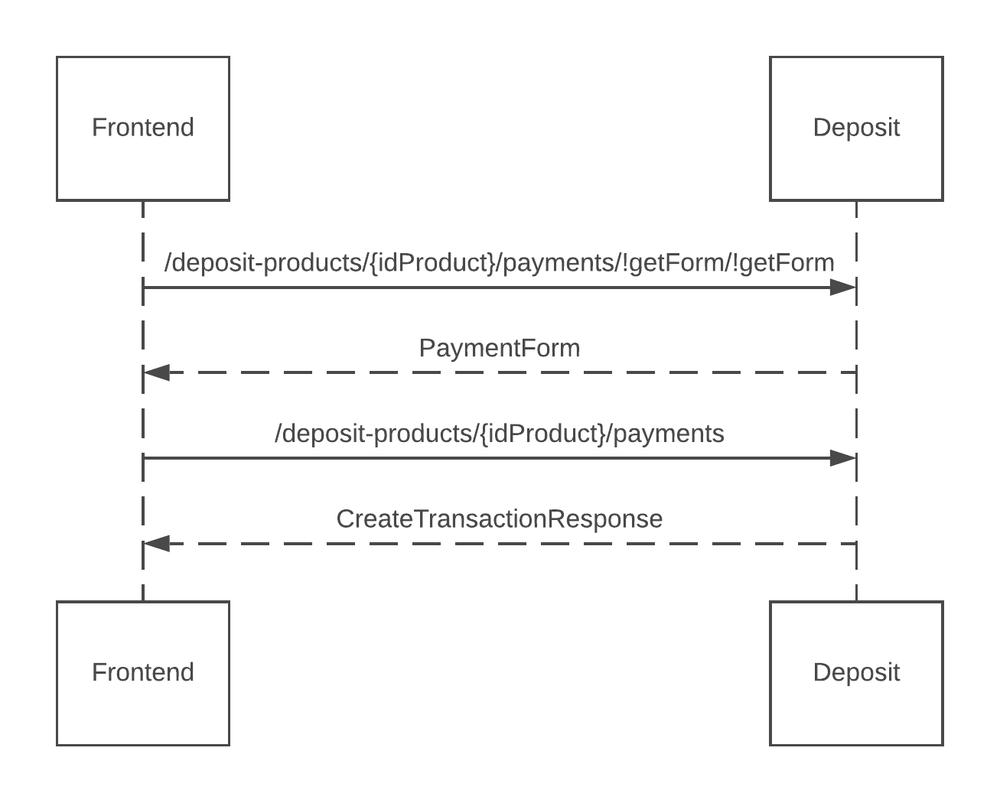

# IB Deposits

The **deposit service** is responsible for allowing a user to view and manage their deposit product accounts and create payments.

## Overview

### Deposit Product Account
A [deposit product](https://doc.ffc.internal/book/mw-ib/mw-gen-deposit-ib/deposit-ib/latest/index.html#docs/type/#787) is created during the onboarding process (see [user activation service](https://doc.ffc.internal/book/mw-ib/mw-gen-user-activation-ib.html)). Its parameters are set according to deposit product `type` selected by the user when created. A client can have more then one deposit product.

An account can have multiple currency components, where one is designated as the *primary currency*. The customer has the ability to *activate/deactivate* currency components and change *the primary currency*. The aggregated balance of the account will appear in the primary currency.

### Transactions

The service allows a customer to retrieve and search all their transactions. They also have the ability to update some transaction data i.e add a note etc.

The platform supports *automatic currency conversion* with incoming/outgoing transactions. This can occur when an account has insufficient funds when making an outgoing payment, or an incoming payment is in a currency that is not supported by that account. Thus, a single transaction can contain multiple sub currency conversions and fees.

As a result, there are two types of transactions:
- **RequiredTransaction**: Represents the “primary transaction” being carried out. Includes fees and any necessary auto conversions between currency components to satisfy a payment order. A required transaction can contain multiple *transactions(processedTransactions)*.
- **Transaction(processedTransaction)**: Represents a single transaction i.e a currency conversion or fee. For every transaction there is one *RequiredTransaction*.

Transaction statuses:
- `RESERVED`: transaction reserved by a card processor.
- `CANCELLED`: transaction that has been revoked.
- `PROCESSED`: transaction that has been successfully processed.

Other meta data associated with a transaction i.e merchant name can be found in the `extendedAttributes` property. List of all potential extendedAttributes can be found here [/transactions/!extendedAttributesDefinition](https://doc.ffc.internal/book/mw-ib/mw-gen-deposit-ib/deposit-ib/latest/#docs/method/#1946).

### Payments

The service allows a customer to create payment orders internally and externally:
- **Internal Payment**: Payment between two internal accounts on the platform.
- **External Payment**: Payment from an internal account to an account on an external platform.

Types of Payments:
- **Unauthorized Payments**: External payments **must** be authorised by the customer. The customer can perform authorisation using the [Auth service](https://doc.ffc.internal/book/mw-ib/mw-gen-auth-ib.html).
- **Upcoming Payments**: Any payment that is created with a future due date.
- **Deferred Payments**: A payment that is blocked while being processed. This could be due to insufficient funds or a *block* on the account.

#### Payment order flow example

## How to use the service

The **Deposit service** requires that the user has been onboarded, has a deposit product account and is logged in to the Internet Banking service.

Certain operations like changing currency components or creating transactions can only be made when the deposit product is in `ACTIVE` state.

- [Deposit Product](#deposit-product)
    - [Exchange money](#exchange-money)
    - [Share account information](#share-account-information)
- [Managing currency components](#managing-currency-components)
    - [Change primary currency](#managing-currency-components)
    - [Activate/deactivate components](#managing-currency-components)
- [Transactions](#transactions)
    - [Required transactions](#transactions)
    - [Transactions](#transactions)
- [Payments](#payments)
    - [Unauthorized payments](#unauthorized-payments)
    - [Upcoming payments](#upcoming-payments)
    - [Deferred payments](#deferred-payments)
    - [Create internal payment](#create-internal-payment)
    - [Create external payment](#create-external-payment)
    - [Authorising a payment](#authorising-a-payment)

### Deposit Product
To obtain the details of a deposit product, we can call [/{idProduct}](https://doc.ffc.internal/api/mw-gen-deposit-ib/deposit-ib/latest/#docs/method/#1441). The response contains details such as the name, currency components, holders, aggregated balance etc.

We can also get balances for each currency component with [/{idProduct}/!getBalance].

#### Exchange money
To exchange money between currency components call [/currency-exchanges](https://doc.ffc.internal/book/mw-ib/mw-gen-deposit-ib/deposit-ib/latest/index.html#docs/endpoint/#1724).

#### Share account information
To send user account information via email call [/!emailAccountInfo](https://doc.ffc.internal/book/mw-ib/mw-gen-deposit-ib/deposit-ib/latest/index.html#docs/method/#1658).

#### Managing currency components
A user can manage the currency components of a deposit product by updating the primary currency or activating/deactivating currency components.

#### Change primary currency
To change the primary currency component call [/{idProduct}/currencyPriorities](https://doc.ffc.internal/api/mw-gen-deposit-ib/deposit-ib/latest/#docs/method/#1838). The desired primary current should have the highest prioirity.

#### Activate/deactivate components
A currency component can be activated by calling [/{idProduct}/!activateCurrency](https://doc.ffc.internal/api/mw-gen-deposit-ib/deposit-ib/latest/#docs/method/#1877), and deactivated by calling [/{idProduct}/!deactivateCurrency](https://doc.ffc.internal/api/mw-gen-deposit-ib/deposit-ib/latest/#docs/method/#1898). 

In order to deactivate a currency component, it **must** have zero balance and not be the primary currency.

The ability to activate or deactivate currency components also depends on the configuration of the specific deposit product.

### Transactions
Users can retrieve a list of *RequiredTransaction's* or *ProcessedTransaction's*. Either can be filtered by updating the [TransactionListRequest](https://doc.ffc.internal/book/mw-ib/mw-gen-deposit-ib/deposit-ib/latest/#docs/type/#974) object.

Only *RequiredTransaction*'s can be updated. To update see [/required-transactions/{idTransaction}](https://doc.ffc.internal/api/mw-gen-deposit-ib/deposit-ib/latest/#docs/method/#1533).

#### RequiredTransaction's

Use the [/required-transactions/!search](https://doc.ffc.internal/book/mw-ib/mw-gen-deposit-ib/deposit-ib/latest/index.html#docs/method/#1547) endpoint to obtain the list of *id*'s followed by the [/required-transactions/!batchGet](https://doc.ffc.internal/book/mw-ib/mw-gen-deposit-ib/deposit-ib/latest/index.html#docs/method/#1561) call to obtain the detail.

#### ProcessedTransaction's
Use the [/transactions/!search](https://doc.ffc.internal/book/mw-ib/mw-gen-deposit-ib/deposit-ib/latest/index.html#docs/method/#1547) endpoint to obtain the list of *id*'s followed by the [/transactions/!batchGet](https://doc.ffc.internal/book/mw-ib/mw-gen-deposit-ib/deposit-ib/latest/index.html#docs/method/#1561) call to obtain the detail.

### Payments
For each payment type the customer can retrieve a summary containing the aggregated sum, count and a list of payments.

#### Unauthorized Payments
To retrieve a summary of all *unauthorized payments* call [/!getUnauthorizedPaymentsSummary](https://doc.ffc.internal/book/mw-ib/mw-gen-deposit-ib/deposit-ib/latest/index.html#docs/method/#1639).

To retrieve a list of all the *unauthorized payments*, we can call the [/!search](https://doc.ffc.internal/book/mw-ib/mw-gen-deposit-ib/deposit-ib/latest/index.html#docs/method/#1547) endpoint to obtain the list of *id*'s followed by the [/!batchGet](https://doc.ffc.internal/book/mw-ib/mw-gen-deposit-ib/deposit-ib/latest/index.html#docs/method/#1561) call to obtain the payment detail.

#### Upcoming Payments
To retrieve a summary of all *upcoming payments* call [/!getUpcomingSummary](https://doc.ffc.internal/book/mw-ib/mw-gen-deposit-ib/deposit-ib/latest/index.html#docs/method/#1661).

To retrieve a list of all the *upcoming payments*, we can call the [/!search](https://doc.ffc.internal/book/mw-ib/mw-gen-deposit-ib/deposit-ib/latest/index.html#docs/method/#1547) endpoint to obtain the list of *id*'s followed by the [/!batchGet](https://doc.ffc.internal/book/mw-ib/mw-gen-deposit-ib/deposit-ib/latest/index.html#docs/method/#1681) call to obtain the payment detail.

An *upcoming payment* can be cancelled by calling the [/!cancel](https://doc.ffc.internal/book/mw-ib/mw-gen-deposit-ib/deposit-ib/latest/index.html#docs/method/#1700) endpoint.

#### Deferred Payments
To retrieve a summary of all *deferred payments* call [/!getDeferredSummary](https://doc.ffc.internal/book/mw-ib/mw-gen-deposit-ib/deposit-ib/latest/index.html#docs/method/#1626).

To retrieve a list of all the *deferred payments*, we can call the [/!search](https://doc.ffc.internal/book/mw-ib/mw-gen-deposit-ib/deposit-ib/latest/index.html#docs/method/#1483) endpoint to obtain the list of *id*'s followed by the [/!batchGet](https://doc.ffc.internal/book/mw-ib/mw-gen-deposit-ib/deposit-ib/latest/index.html#docs/method/#1503) call to obtain the payment detail.

*Deferred* payment detail can be obtained by calling the [/deferred-transactions/{idTransaction}](https://doc.ffc.internal/book/mw-ib/mw-gen-deposit-ib/deposit-ib/latest/index.html#docs/method/#1517) endpoint.

A *deferred payment* can be cancelled by calling the [/!cancel](https://doc.ffc.internal/book/mw-ib/mw-gen-deposit-ib/deposit-ib/latest/index.html#docs/method/#1525) endpoint.

#### Create internal payment
An Internal payment can be created by calling the [/!createInternalCreditTransfer](https://doc.ffc.internal/book/mw-ib/mw-gen-deposit-ib/deposit-ib/latest/index.html#docs/method/#1748). The amount and the recipient's internal account number must be provided.

#### Create external payment

To create an external payment, we must:

1. **Retrieve the PaymentForm entity**. This lists all key-value attributes required to complete the order e.g. amount, account number, country etc. Each attribute has a name as well as some validation rules (e.g. optional or mandatory, maximum length etc.). The attributes returned are based on the payment method.
2. **Capture the attributes from the front-end application** and send to the server for processing.

If everything is alright, the payment order is created.

#### Authorising a payment
Unauthorized payments can be authorised using the [Auth service](https://doc.ffc.internal/book/mw-ib/mw-gen-auth-ib.html).
1. Customer attempts to approve a payment by calling the [/!approve](https://doc.ffc.internal/book/mw-ib/mw-gen-deposit-ib/deposit-ib/latest/index.html#docs/method/#1595) endpoint. Authorization is required if the response status code is `418`. The response will contain auth scenarios such as `PWD`, `SMS`, `PWD_SMS` etc. One of scenarios must be satisfied before authorisation can occur.
2. Kick of the [Auth service](https://doc.ffc.internal/book/mw-ib/mw-gen-auth-ib.html). The response will contain the steps to be carried out for the given auth scenario.
3. Validate the steps.
4. Call the [/!approve](https://doc.ffc.internal/book/mw-ib/mw-gen-deposit-ib/deposit-ib/latest/index.html#docs/method/#1595) endpoint again to complete the authorization.  

