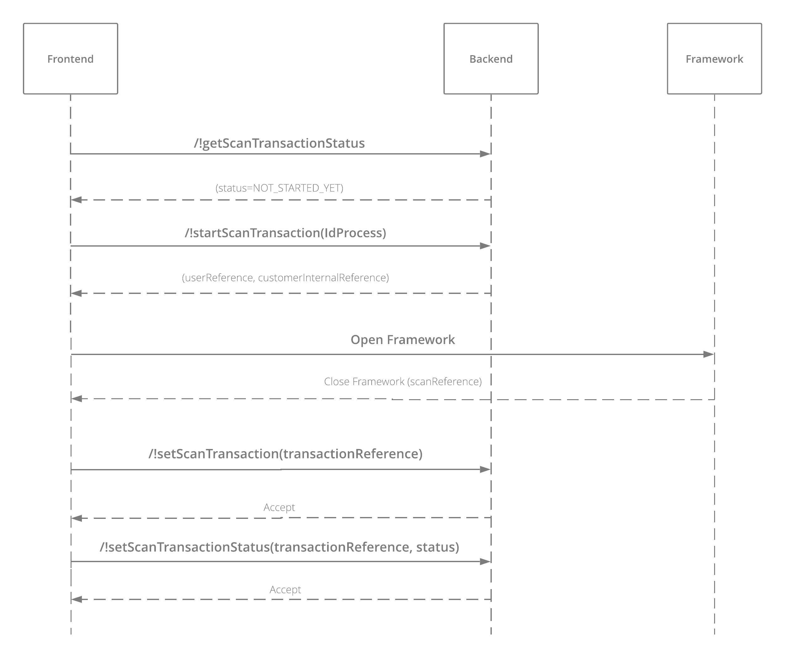

# IB JUMIO

The **jumio service** is responsible for verifing the customer identity, proofing their address and extracting the information from the files uploaded.

## Responsibilities of the service

The service has the responsabilities:
* **Proof the customer identity** and **extract the data** from the file uploaded e.g. ID card, driving license, passport
* **Proof the customer address** and **extract the data** from the file uploaded e.g. Utility bill, bank statement, phone bill

## How to use the service

During the onboarding process, you will get a step *`code`* (see [Onboarding](onboarding.md)). Based on this, you will do:
  * **Proof of identity (POI)** to extract the identity data from the customer (code:  `JUMIO`)
  * **Proof of address (POA)** to extract the address data from the customer (code: `JUMIO_POA`)

The way to handle these codes will be different depending on the channel **web** or **mobile**.

 ### Handling mobile channel

Whether the flow you have to do is **proof of identity** or **address**, you have to follow the same steps.

You will only change the url you are using in each case:
* **Proof of identity (POI)**: `api/private/jumio/poi/` eg: `api/private/jumio/poi/!getScanTransactionStatus`
* **Proof of address (POA)**:  `api/private/jumio/poa/` eg: `api/private/jumio/poa/!getScanTransactionStatus`

The steps you have to follow to complete the **scan transaction** are:

1. Call `/!getScanTransactionStatus` to know whether the actual status of the transaction was started or not. If the transaction has not started (status: `NOT_STATED_YET` or `PENDING`), move on to the next step. If it's finished (status: `SUCCESS`), go back to the onboarding flow.

2. Call `/!startScanTransaction` with the `processId` to start the scan transaction. This will return you all data you need to open the framework.

3. **Open the framework**. Depending on the data you want to extract, you will use:
 * **Netverify** to proof of identity case (see [iOS](https://github.com/Jumio/mobile-sdk-ios/blob/master/docs/integration_netverify-fastfill.md) and [Android](https://github.com/Jumio/mobile-sdk-android/blob/master/docs/integration_netverify-fastfill.md))
 * **Document verification** to proof of address case (see [iOS](https://github.com/Jumio/mobile-sdk-ios/blob/master/docs/integration_document-verification.md) and [Android](https://github.com/Jumio/mobile-sdk-android/blob/master/docs/integration_document-verification.md))

When the framework has finished, it will be closed and return to the app a `scanReference`. The back-end will use this reference to extract the data.

4. Call `/!setScanTransaction` to send the `scanReference`.
5. Call `/!setScanTransactionStatus` to send the `status`.
6. Go back to the onboarding flow.

### Handling web channel

Add the flow.

### Frameworks

- Real Jumio
- Mock Jumio
- Web Jumio
