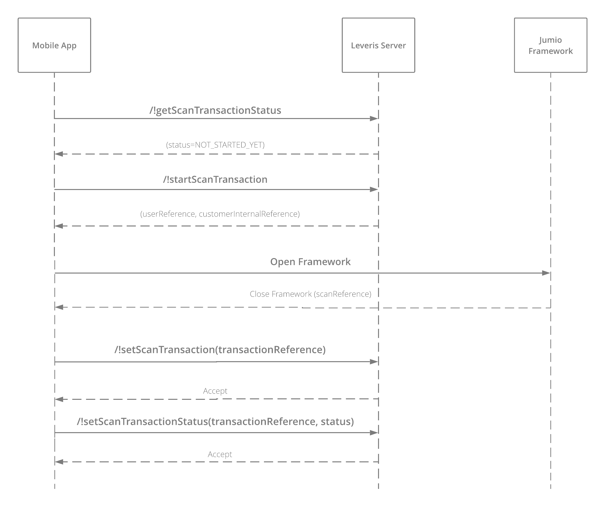
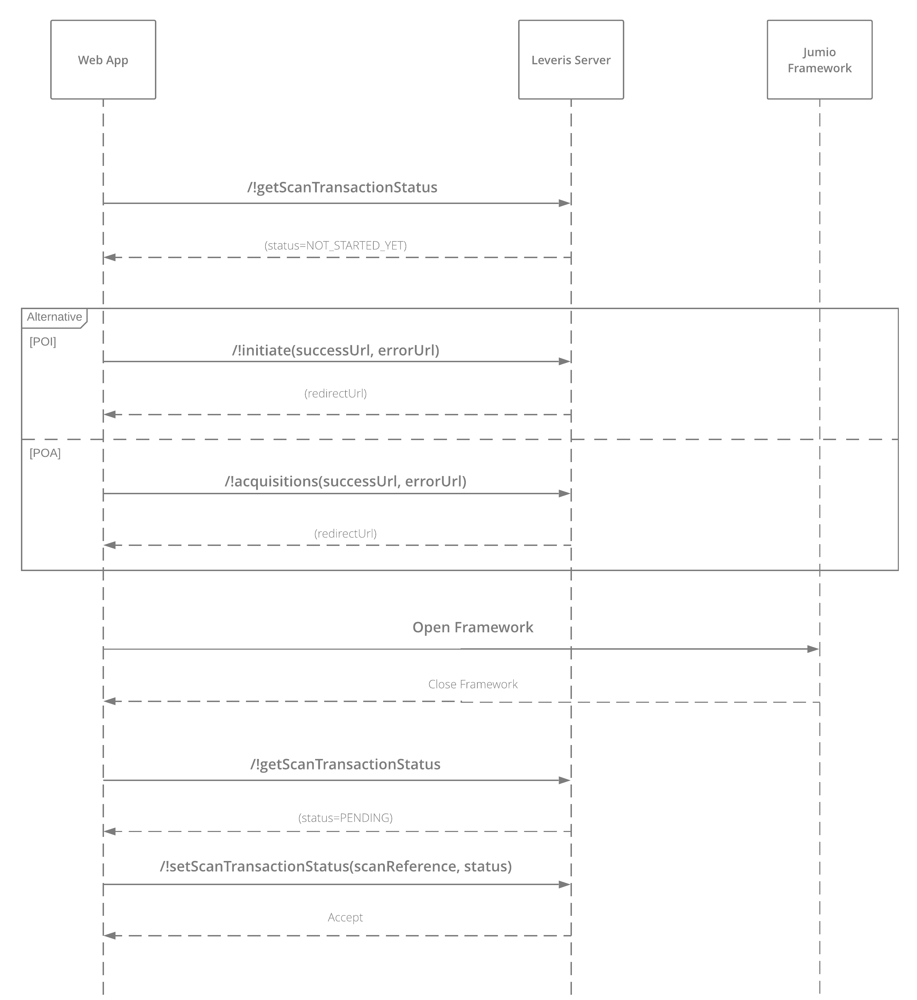

# IB JUMIO

The **jumio service** is responsible for verifing the customer identity, proving their address and extracting the information from the uploaded files.

## Responsibilities of the service

The service has the responsabilities:
* **Prove the customer identity** and **extract the data** from the uploaded file e.g. ID card, driving license, passport
* **Prove the customer address** and **extract the data** from the uploaded file e.g. Utility bill, bank statement, phone bill

## How to use the service

A *`code`*  will be obtained from the onboarding process (see [Onboarding](onboarding.md)). Based on this you will have different **scan transactions**:

  * **Proof of identity (POI)** where the customer will upload the identity files and take a photo of himself (code:  `JUMIO`)
  * **Proof of address (POA)** where the customer will upload the address files (code: `JUMIO_POA`)

When the upload is completed, Jumio will:
1. **Extract the data** from the files
2. **Verify the data**
3. **Send the data** to the backend. This will possible due to a **callback** configurates before the framework is open.

The flow to follow in all scan transactions is the same. You only have to change the urls you are using in each one:
  * **Proof of identity (POI)**: `api/private/jumio/poi/` eg: `api/private/jumio/poi/!getScanTransactionStatus`
  * **Proof of address (POA)**:  `api/private/jumio/poa/` eg: `api/private/jumio/poa/!getScanTransactionStatus`

However, the way to handle these scan transactions will be different depending on the channel **web** or **mobile**.

 ### Handling mobile channel

The steps you have to follow to complete the **scan transaction** are:

1. Call `/!getScanTransactionStatus` to know whether the actual status of the transaction was started or not. If the transaction has not started (status: `NOT_STATED_YET` or `PENDING`), move on to the next step. If it's finished (status: `SUCCESS`), go back to the onboarding flow.

2. Call `/!startScanTransaction` with the `processId` to start the scan transaction. This will return you all data you need to open the framework.

3. Open the framework. Depending on the data you want to extract, you will use:
 * **Netverify** to proof of identity (see [iOS](https://github.com/Jumio/mobile-sdk-ios/blob/master/docs/integration_netverify-fastfill.md) and [Android](https://github.com/Jumio/mobile-sdk-android/blob/master/docs/integration_netverify-fastfill.md))
 * **Document verification** to proof of address (see [iOS](https://github.com/Jumio/mobile-sdk-ios/blob/master/docs/integration_document-verification.md) and [Android](https://github.com/Jumio/mobile-sdk-android/blob/master/docs/integration_document-verification.md))

When the framework has finished, it will be closed and return to the app a `scanReference`. The back-end will use this reference to extract the data.

4. Call `/!setScanTransaction` to send the `scanReference`.

5. Call `/!setScanTransactionStatus` to send the `status`.

6. Go back to the onboarding flow.

### Handling web channel

The steps you should follow to complete the **scan transaction** are:

1. Call `/getScanTransactionStatus` to know whether the actual status of the transaction was started or not. If the transaction has not started (status: `NOT_STARTED_YET`), move on to the next step. If it's finished (status: `SUCCESS`), go back to the onboarding flow.

2. Get the framework url to start the upload. Depending on the type of the scan transaction, you will use `/!initiate` (proof of identity) or `/!acquisitions` (proof of address). Add the `successUrl` and `errorUrl` to the body of the request so the framework knows where it should come back in the case of success and error.  The call returns the `redirectUrl`.

3. Call the `redirectUrl`. This will open the correct framework. When the framework has completed the loading files, it will return to the previous configurated `successUrl` if everything was correct.

4. Call the `/getScanTransactionStatus` to get the actual status of the transaction. If the transaction is pending (status: `PENDING`) move on to the next step.

5. Send the `scanReference`and `status` with `/setScanTransactionStatus`.

6. Go back to the onboarding flow.

### Frameworks

- Real Jumio
- Mock Jumio
- Web Jumio
