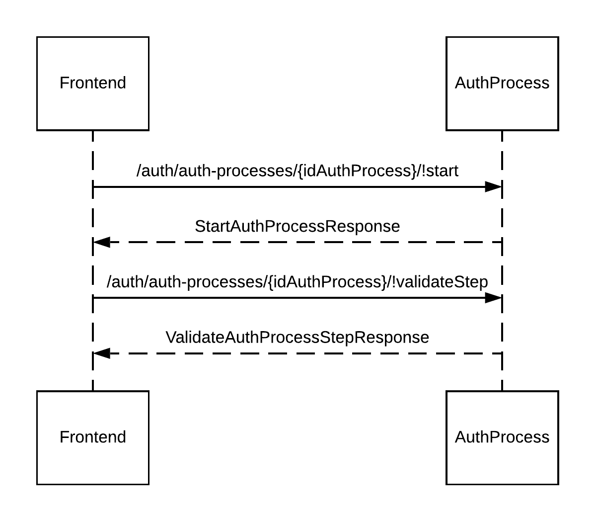

# Authorzation and Authentication
This service provides support for user authorization and authentication. It ensures a user has the correct access rights to perform an operation/access a resource.

The authorization flow is handled by a `step-up authentication` process. The process is comprised of a number of scenarios and is driven by the user. A scenario includes one or more steps that must be fulfilled by the user(Password, OTP(one-time password) etc) to complete the process.

Any operation that returns a `418` status code indicates that authorization is required. Although, in some cases the operation might be temporarily disabled.

For more details see [Auth Process API](https://doc.ffc.internal/book/mw-ib/mw-gen-auth-ib/auth-ib/latest/index.html#docs/summary/summary).

## Responsibilities of the service

- Provides all possible authorization scenarios(i.e Password, OTP etc) for a given operation.
- Maintains authorization process.
- Verifies user input for given authorization scenario.

## How to use the service
When a user attempts an operation and is greeted by `418` response. The response body contains an array of possible scenarios. Each scenario contains a `code`, `steps` and `idAuthProcess`.

The `idAuthProcess` is required to kick of a `step-up authentication` process.

```
"scenarios": [
    {
        "code": "PWD",
        "steps": [
            {
                "details": [
                    {
                        "code": "PWD",
                        "order": 0,
                        "pinPositions": []
                    }
                ]
            }
        ],
        "idAuthProcess": "E7ltE2SSMCqecpU22pFJBT9pTsNpwbtvqHRo9KuQQigeTBisoaBE4YGSsAsbT9rc_pvAkebe8GW87ydxlifgPw=="
    }
]
```

If a user has insufficient security details attached to their account, for example if they do not have OTP setup. The response body will be empty. In such a scenario, the user needs to contact customer support to resolve the issue.


### Step-up authentication process
1. To start the process, call `/auth-processes/{idAuthProcess}/!start` endpoint in Auth Process API. The given `idAuthProcess` determines the scenario.
2. For every step of the process - the user will be required to input data. Each step can be validated by calling the `/auth-processes/{idAuthProcess}/!validateStep` endpoint. When the process is complete and successful the response will contain `result = FINISH`.

Authorization is complete. The consumer application can call the original operation endpoint again with the `idAuthProcess` to complete the operation.


